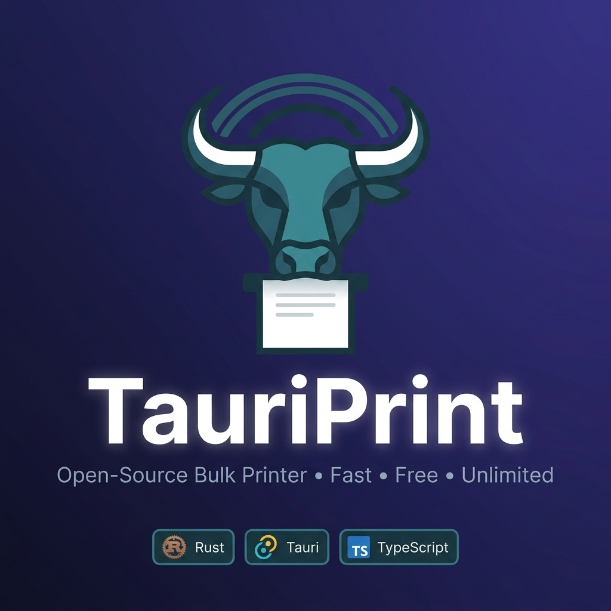
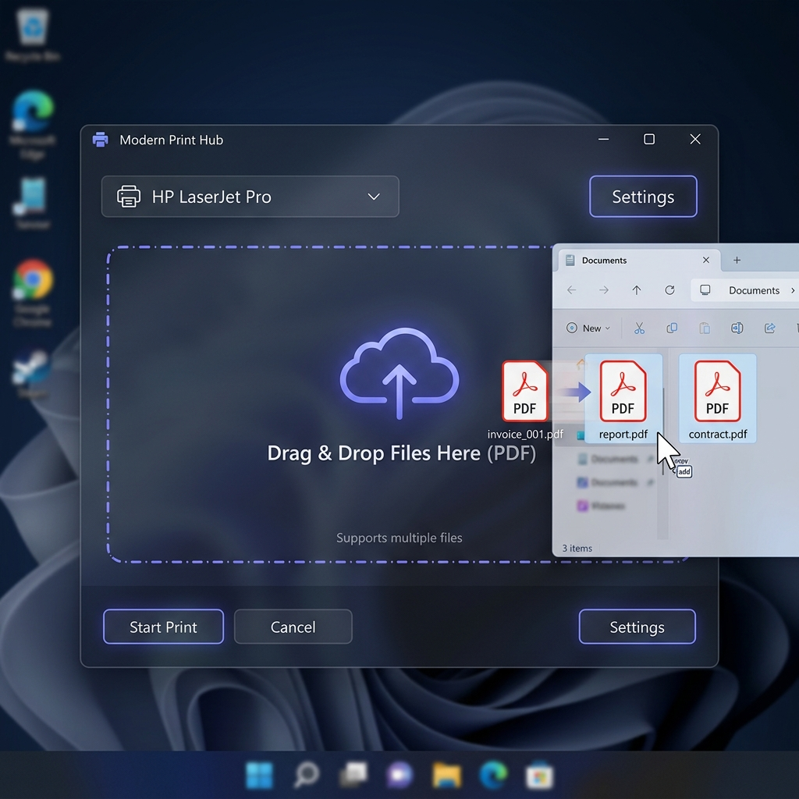
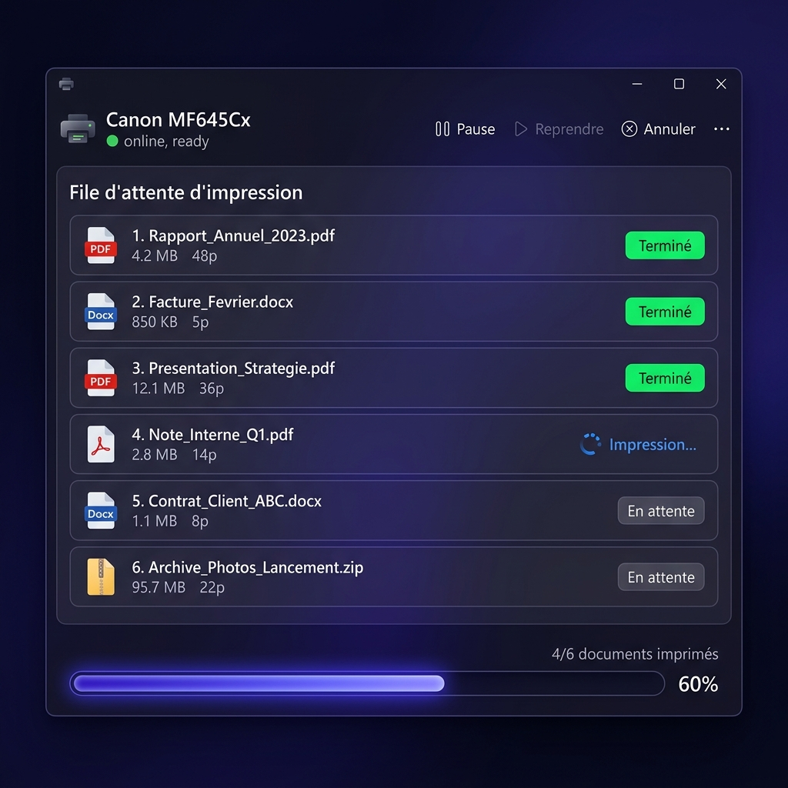
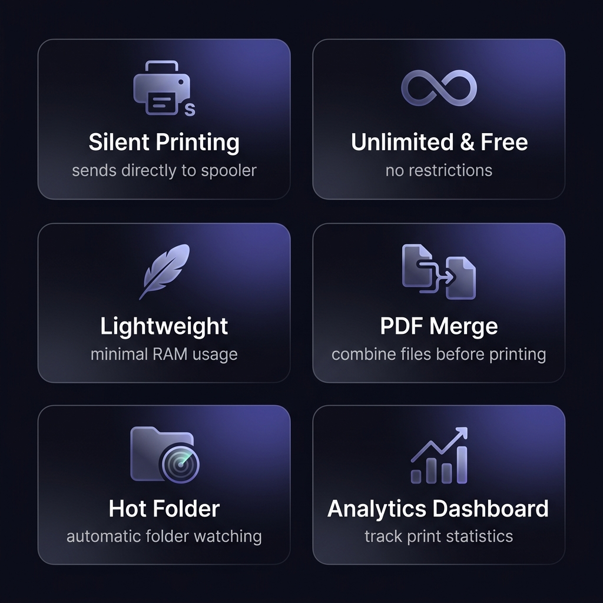

<div align="center">

  <!-- Animated SVG header -->
  

  # 🖨️ TauriPrint — Open-Source Bulk Printer

  **L'alternative libre, rapide et sans limites pour l'impression de documents en masse.**

  [](https://github.com/Sartome/PrintMax/releases)
  [](LICENSE)
  [](https://tauri.app)
  [](https://www.rust-lang.org/)
  [](https://www.typescriptlang.org/)

  <br />

  [📥 Télécharger](https://github.com/Sartome/PrintMax/releases) · [🐛 Signaler un bug](https://github.com/Sartome/PrintMax/issues) · [💡 Proposer une fonctionnalité](https://github.com/Sartome/PrintMax/issues/new)

</div>

<br />

<div align="center">
  
</div>

<br />

---

## 📖 À propos

> **TauriPrint** est né d'une frustration simple : la plupart des utilitaires d'impression par lots (*Bulk Printers*) adoptent des modèles économiques agressifs (*Bait-and-Switch*) en bloquant l'utilisateur après 3 impressions pour forcer l'achat d'une licence "Pro".

Ce projet est la **réponse open-source** à ce problème.

Construit avec **Tauri V2** et **Rust**, TauriPrint est un utilitaire de bureau ultra-léger qui permet de **glisser-déposer des dizaines de fichiers** et de les envoyer silencieusement vers votre imprimante — **sans jamais ouvrir la moindre application tierce**.

<br />

---

## 🎬 Démonstrations

<div align="center">

### Glissez-Déposez vos fichiers



<sub>Glissez vos PDF, images et documents directement dans l'application</sub>

<br /><br />

### Suivi en temps réel de la file d'attente



<sub>Chaque fichier affiche son statut : En attente → Impression → Terminé ✅</sub>

</div>

<br />

---

## ✨ Fonctionnalités

<div align="center">
  
</div>

<br />

<table>
  <tr>
    <td width="50%">

### 🚀 Impression silencieuse
Envoi direct au spooler d'impression Windows via **SumatraPDF** embarqué. Aucun pop-up, aucune fenêtre.

### 🆓 100% Gratuit & Illimité
Aucune restriction artificielle. Imprimez **1 ou 1000 documents**, c'est pareil.

### 🪶 Poids plume
Grâce à **Rust**, l'application consomme un minimum de RAM et de CPU. Pas d'Electron ici.

### 📊 Tableau de bord analytique
Suivez vos statistiques d'impression : pages imprimées, impressions recto-verso, erreurs.

  </td>
  <td width="50%">

### 📁 Hot Folder
Surveillez un dossier automatiquement. Tout fichier déposé dedans est **imprimé instantanément**.

### 🔀 Fusion PDF
Fusionnez tous vos PDF en un seul document avant impression — en un clic.

### 📄 Pages de garde
Intercalez automatiquement une page de séparation entre chaque document imprimé.

### ⚙️ Pré-opérations
Configurez un pipeline de transformations (fusion, pages de garde) exécuté dans l'ordre avant l'impression.

  </td>
  </tr>
</table>

<details>
<summary><b>🔧 Fonctionnalités avancées</b> (cliquez pour dérouler)</summary>
<br />

| Fonctionnalité | Description |
|---|---|
| 🎛️ **Profils d'impression** | Sauvegardez et chargez des configurations complètes (imprimante, copies, recto-verso, format…) |
| 🏷️ **Alias d'imprimante** | Créez des noms courts pour vos imprimantes (`couleur-rdc`, `nb-1er-etage`) |
| ⏱️ **Planification** | Programmez une impression à une heure précise |
| 🔄 **Retry automatique** | En cas d'échec, retente automatiquement l'impression (configurable) |
| 📋 **Logs CSV** | Exportez l'historique complet de vos impressions |
| 🖨️ **Propriétés imprimante** | Accédez directement aux propriétés système de l'imprimante |
| 🌐 **Proxy** | Support proxy HTTP/HTTPS pour les mises à jour |
| 🔔 **Notifications** | Alertes système Windows pour les événements d'impression |
| ⏸️ **Pause / Reprise** | Contrôlez la file d'attente en temps réel |
| 🗂️ **Archivage auto** | Déplacez automatiquement les fichiers après impression (succès/erreur) |

</details>

<br />

---

## 🛠️ Pile Technologique

<div align="center">

```
┌─────────────────────────────────────────────┐
│              TauriPrint Architecture         │
├──────────────────┬──────────────────────────┤
│   Frontend       │   Backend                │
│                  │                          │
│   TypeScript     │   Rust 🦀                │
│   HTML5 / CSS3   │   Tokio (async runtime)  │
│   Tailwind CSS   │   SumatraPDF (moteur)    │
│   Chart.js       │   lopdf (fusion PDF)     │
│                  │   notify (hot folder)    │
├──────────────────┴──────────────────────────┤
│              Tauri V2 (IPC Bridge)          │
└─────────────────────────────────────────────┘
```

</div>

<br />

---

## 🚀 Installation & Développement local

### 📋 Prérequis

| Outil | Version | Lien |
|---|---|---|
| **Rust** (rustup) | stable | [rustup.rs](https://rustup.rs/) |
| **Node.js** | ≥ 18 | [nodejs.org](https://nodejs.org/) |
| **VS C++ Build Tools** | 2022+ | [Visual Studio](https://visualstudio.microsoft.com/visual-cpp-build-tools/) |

### ⚡ Démarrage rapide

```bash
# 1. Cloner le dépôt
git clone https://github.com/Sartome/PrintMax.git
cd PrintMax/RustPrinter

# 2. Installer les dépendances frontend
npm install

# 3. Lancer l'application en mode développement
npm run tauri dev
```

> **Note** : Lors du premier lancement, le compilateur Rust téléchargera et compilera les crates. Cette étape peut prendre **3-5 minutes**.

### 📦 Compiler pour la production

```bash
npm run tauri build
```

L'exécutable `.exe` et l'installateur `.msi` se trouveront dans `src-tauri/target/release/bundle/`.

<br />

---

## 🤝 Contribuer

Les contributions sont **grandement appréciées** ! Que ce soit pour corriger un bug, ajouter une fonctionnalité ou améliorer l'interface :

1. **Forkez** le projet
2. Créez votre branche de fonctionnalité (`git checkout -b feature/MaSuperFonctionnalite`)
3. Commitez vos changements (`git commit -m 'feat: ajout de MaSuperFonctionnalite'`)
4. Poussez vers la branche (`git push origin feature/MaSuperFonctionnalite`)
5. Ouvrez une **Pull Request**

<br />

---

## ⭐ Soutenez le projet

Si TauriPrint vous est utile, **une étoile ⭐ sur le dépôt** est le meilleur moyen de soutenir le projet et d'augmenter sa visibilité !

<div align="center">

[](https://star-history.com/#Sartome/PrintMax&Date)

</div>

<br />

---

## 📄 Licence

Distribué sous la licence **MIT**. Voir le fichier [`LICENSE`](LICENSE) pour plus d'informations.

<br />

<div align="center">

  Fait avec ❤️ et 🦀 par [Sartome](https://github.com/Sartome)

  <sub>TauriPrint — Imprimez librement, sans limites.</sub>

</div>